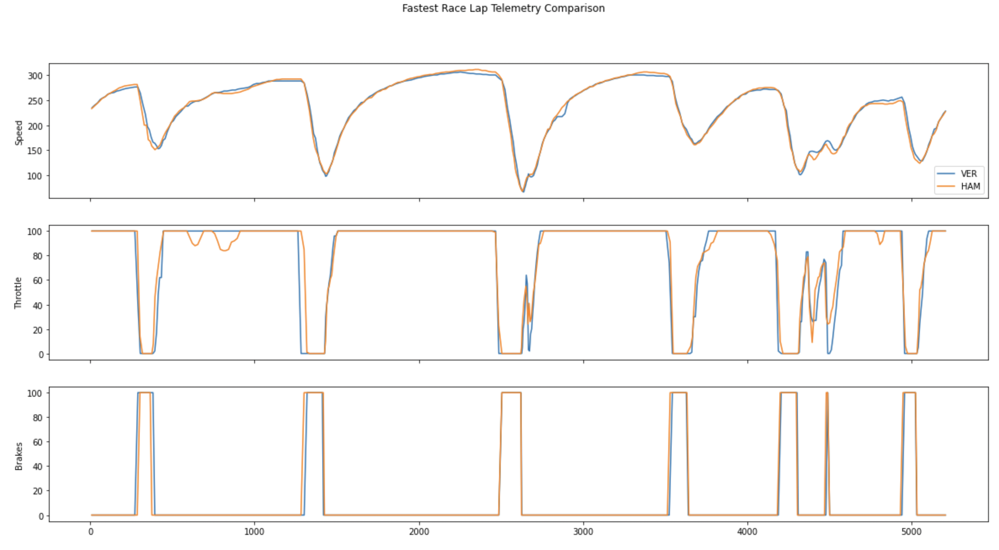

# formula-1-lap-comparison-orchest

This pipeline uses the [fastf1](https://pypi.org/project/fastf1/) package to visualize.

Credits to the idea and code of lap comparison go to [Jasper](https://medium.com/towards-formula-1-analysis/analyzing-formula-1-data-using-python-2021-dutch-gp-hamilton-vs-bottas-145945eac278).

Example comparison:



To run it for your favorite driver/Grand Prix combination modify the pipeline parameters:

```
{
    "d1": "VER",
    "d2": "HAM",
    "race_gp": "Abu Dhabi",
    "race_year": 2021
}
```


